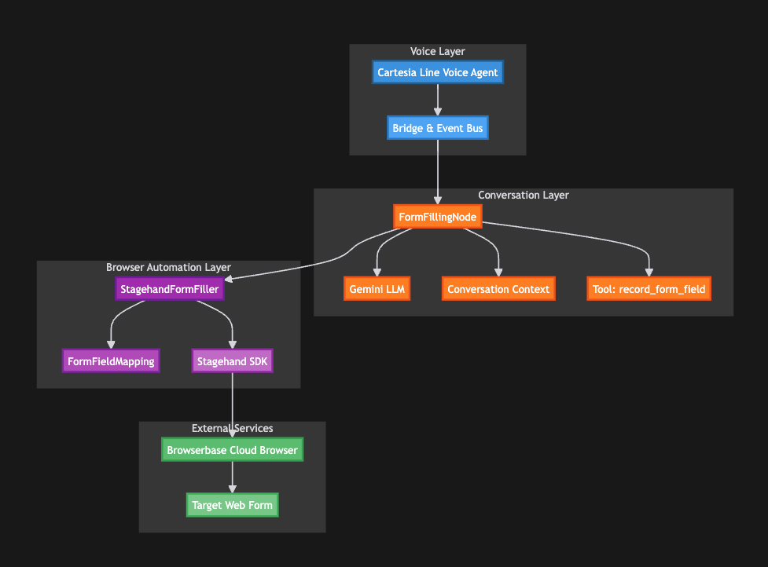

# Voice Agent with Real-time Web Form Filling

This project demonstrates an advanced voice agent that conducts phone questionnaires while automatically filling out web forms in real-time using Stagehand browser automation.

Here's what the system architecture looks like:



## Features

- **Voice Conversations**: Natural voice interactions using Cartesia Line
- **Real-time Form Filling**: Automatically fills web forms as answers are collected
- **Browser Automation**: Uses Stagehand AI to interact with any web form
- **Intelligent Mapping**: AI-powered mapping of voice answers to form fields
- **Async Processing**: Non-blocking form filling maintains conversation flow - form fields are filled in background tasks without delaying voice responses
- **Auto-submission**: Submits forms automatically when complete

## Architecture

```
Voice Call (Cartesia) → Form Filling Node → Records Answer
                              ↓
                     Stagehand Browser API
                              ↓
                     Fills Web Form Field
                              ↓
                     Continues Conversation
                              ↓
                     Submits Form on Completion
```

## Getting Started

First things first, here is what you will need:
- A [Cartesia](https://play.cartesia.ai/agents) account and API key
- A [Gemini API Key](https://aistudio.google.com/apikey)
- A [Browserbase API Key and Project ID](https://www.browserbase.com/overview) 

Make sure to add the API keys in your `.env` file or to the API keys section in your Cartesia account.

- Required packages:
  ```bash
  cartesia-line
  stagehand>=0.5.4
  google-genai>=1.26.0
  python-dotenv>=1.0.0
  PyYAML>=6.0.0
  loguru>=0.7.0
  aiohttp>=3.12.0
  pydantic>=2.0.0
  ```

## Setup

1. Install dependencies:
```bash
pip install -r requirements.txt
```

2. Set up environment variables - create a `.env` file:
```bash
GEMINI_API_KEY=your_gemini_api_key_here
BROWSERBASE_API_KEY=your_browserbase_api_key_here
BROWSERBASE_PROJECT_ID=your_browserbase_project_id_here
```

3. Run the agent:
```bash
python main.py
```

## Project Structure

### `main.py`
Entry point for the voice agent. Handles call initialization with `VoiceAgentApp` class and orchestrates the conversation flow with form filling integration.

### `form_filling_node.py`
ReasoningNode subclass customized for voice-optimized form filling. Integrates Stagehand browser automation and manages async form filling during conversation without blocking the voice flow. Provides status updates and error handling.

### `stagehand_form_filler.py`
Browser automation manager that handles all web interactions. Opens and controls web forms, maps conversation data to form fields using AI, transforms voice answers to form-compatible formats, and handles form submission. Supports different field types (text, select, checkbox, etc.).

### `config.py`
System configuration file including system prompts, model IDs, and temperature

### `config.toml`
Your Cartesia Line agent id.

## Configuration

The system can be configured through multiple files:

- **`config.py`**: System prompts, model IDs (Gemini model selection), hyperparameters, and boolean flags for features
- **`config.toml`** / **YAML files**: Questionnaire structure and questions flow
- **`cartesia.toml`**: Deployment configuration for Cartesia platform (installs dependencies and runs the script)
- **Variables**:
  - `FORM_URL`: Target web form to fill

## Example Flow

1. User calls the voice agent
2. Agent asks: "What type of voice agent are you building?"
3. User responds: "A customer service agent"
4. System:
   - Records the answer
   - Opens browser to form (if not already open)
   - Fills "Customer Service" in the role selection field
   - Takes screenshot for debugging
5. Agent asks next question
6. Process continues until all questions answered
7. Form is automatically submitted

## Advanced Features

- **Background Processing**: Form filling happens asynchronously using background tasks - conversation remains smooth and responsive
- **Error Recovery**: Continues conversation even if form filling fails
- **Progress Tracking**: Monitor form completion status
- **Screenshot Debugging**: Captures screenshots after each field
- **Flexible Mapping**: AI interprets answers for different field types

## Deploying the Agent

The `cartesia.toml` file defines how your agent will be installed and run when deployed on the Cartesia platform. This file tells the platform to install dependencies from `requirements.txt` and execute `main.py`.

You can clone this repository and add it to your [agents dashboard](https://play.cartesia.ai/agents) along with your API Keys (set them in the Cartesia Platform's API keys section).

For detailed deployment instructions, see [how to deploy an agent from the Cartesia Docs](https://docs.cartesia.ai/line/start-building/talk-to-your-first-agent).

## Testing

Test with different scenarios:
- Complete questionnaire flow
- Interruptions and corrections
- Various answer formats
- Multi-page forms
- Form validation errors

## Production Considerations

- Configure proper error logging
- Add retry logic for form submission
- Implement form validation checks
- Consider rate limiting for API calls